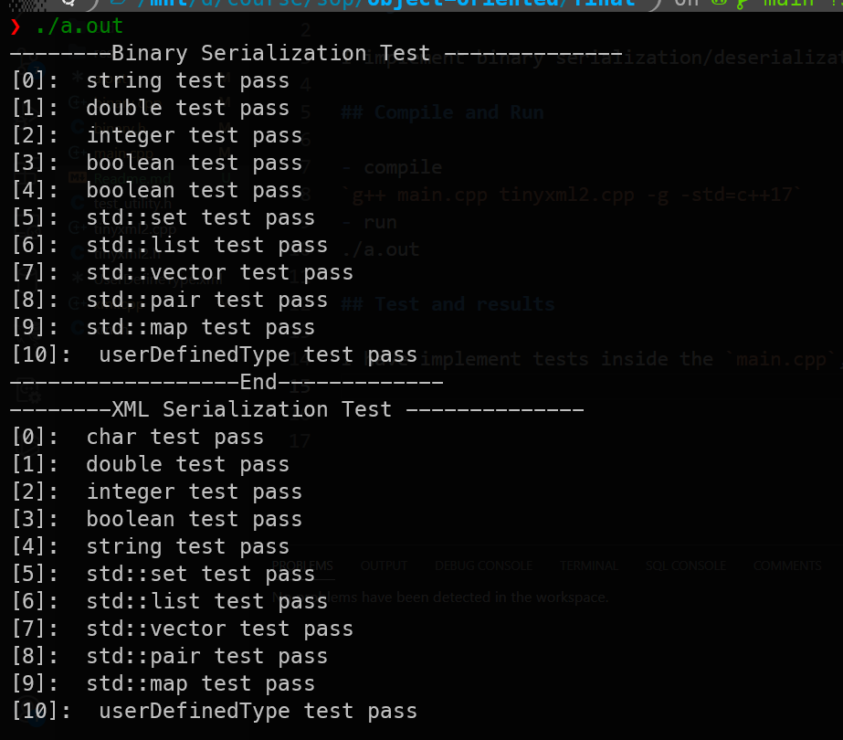

# Object Serialization 

I implement binary serialization/deserialization as well as XML serialization/deserialization modules;

## Compile and Run

- compile
`make -j`
- run
`./main`

## Test and results

I have implement tests inside the `main.cpp`, the result is following:

You can view the test code to validate the coorectness of my test.

