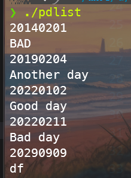
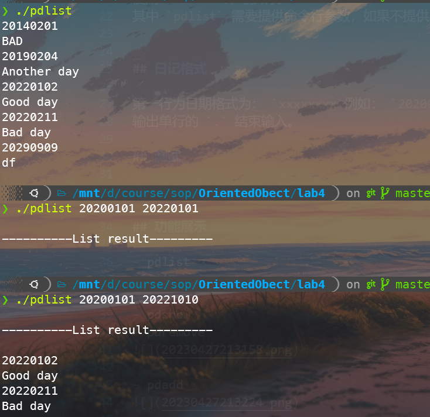
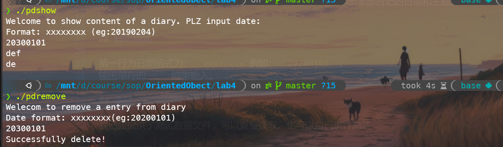
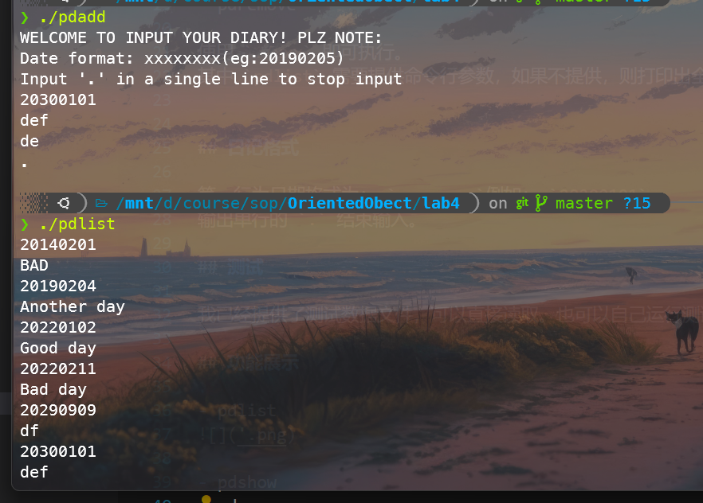

# Personal Diary

## 编译运行

输入以下命令编译：

```bash
g++ entity.cpp diary.cpp pdadd.cpp -o pdadd --std=c++17    
g++ entity.cpp diary.cpp pdlist.cpp -o pdlist --std=c++17    
g++ entity.cpp diary.cpp pdremove.cpp -o pdremove --std=c++17    
g++ entity.cpp diary.cpp pdshow.cpp -o pdshow --std=c++17   
```

生成了四个可执行文件：

- pdlist
- pdadd
- pdshow
- pdremove

使用 `./xxx` 即可执行。
其中 `pdlist` 需要提供命令行参数，如果不提供，则打印出全部日记的日期和主题。


## 日记格式

第一行为日期格式为： `xxxxxxxx`例如： `20200101` 。
输出单行的 `.` 结束输入。

## 测试

我已经提供了测试数据文件，可以直接读取。也可以自己运行测试

** Linux用户可以运行 `./go.sh` 来运行我准备好的测试 **

## 功能展示

- pdlist


- pdlist (带参数)


- pdshow

- pdremove


- pdadd
  

  
