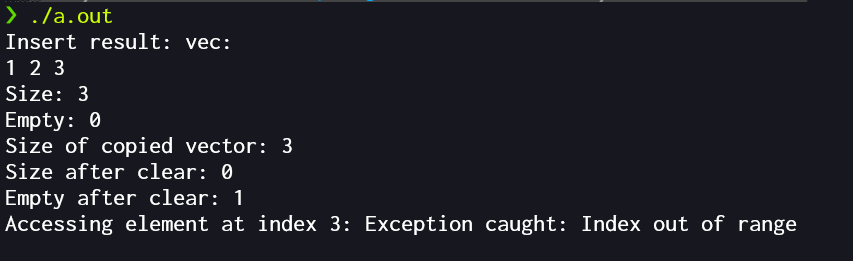

# lab5 Vector

## Compile and run

- Compile
```bash
g++ vector.cpp
```

- run
```bash
./a.out
```

## Test result

I provide demo test in main function, here is the result.

You can modify the main function to verify the correctness.


